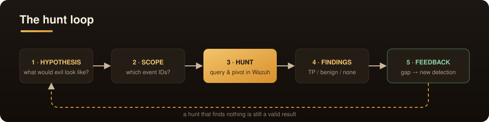
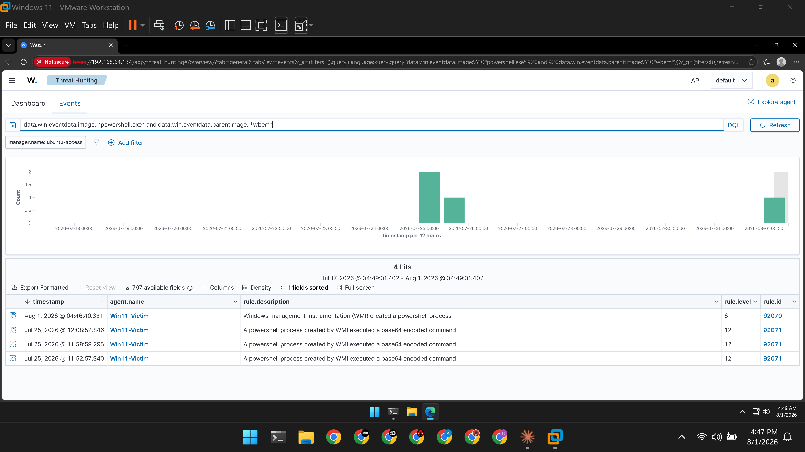
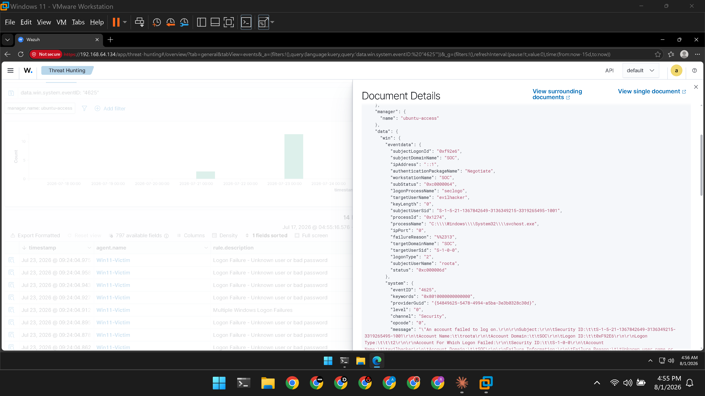
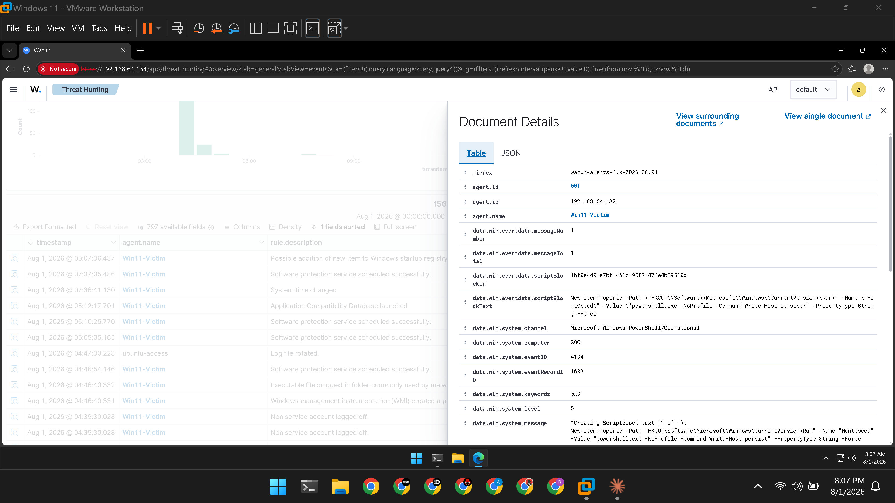
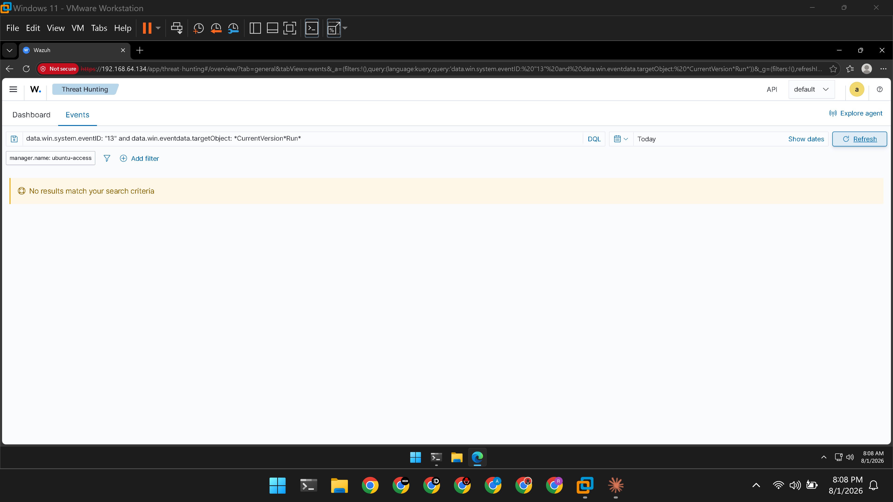

<div align="center">


<br><br>


**Monitoring waits for an alert. Hunting goes looking for the attacker the alerts missed.**

</div>

---

## 📌 Overview

Three **hypothesis-driven threat hunts** through the Sysmon and Windows Event Log telemetry in my
Wazuh lab. For each: state what an attacker would look like, pull the data, pivot, and reach a
verdict — turning any gap into a detection idea. Built on my
[Home SOC](https://github.com/ishehzadanwar/home-soc-wazuh) and
[Detection Engineering](https://github.com/ishehzadanwar/detection-engineering-lab) labs.

| | |
|---|---|
| **Lab** | Wazuh 4.14.6 · Windows 11 + Sysmon · VMware, isolated network |
| **Seeding** | Atomic Red Team + manual technique execution (the "answer key") |
| **Method** | Lightweight PEAK / TaHiTI hunt loop |
| **Story** | Execution → Credential Access → Persistence |

---

## 🎯 The hunts

| # | Hunt | ATT&CK | Data source | Verdict | Write-up |
|---|------|--------|-------------|---------|----------|
| 1 | Shell spawned by an unusual parent (WMI) | [T1047](https://attack.mitre.org/techniques/T1047/) / [T1059.001](https://attack.mitre.org/techniques/T1059/001/) | Sysmon EID 1 | True positive | [→](hunts/01-wmi-spawned-shell.md) |
| 2 | Anomalous logons (brute force / privilege) | [T1110](https://attack.mitre.org/techniques/T1110/) / [T1078](https://attack.mitre.org/techniques/T1078/) | Security 4625 / 4672 | True positive + benign | [→](hunts/02-anomalous-logons.md) |
| 3 | Registry Run-key persistence | [T1547.001](https://attack.mitre.org/techniques/T1547/001/) | Sysmon EID 13 → PowerShell 4104 | True positive + **gap found** | [→](hunts/03-registry-run-key-persistence.md) |

> A hunt that finds nothing is still a valid, documented result — it narrows the space and often
> exposes a visibility gap. See the [event-ID cheat sheet](cheatsheet-event-ids.md) for the
> telemetry these hunts rely on, and [`queries/`](queries/wazuh-queries.md) for every query used.

---

## 🔁 The method

<div align="center">
  
</div>

---

## 📂 Repository structure

```
windows-threat-hunt/
├── README.md
├── cheatsheet-event-ids.md   the event IDs / logon types / fields a hunter relies on
├── docs/                     banner + hunt-loop diagram
├── hunts/                    one full hunt report per hypothesis (3)
├── queries/
│   └── wazuh-queries.md      every hunt query, reusable
└── evidence/
    └── screenshots/          proof for each hunt
```

---

## 🧪 Hunt 1 — Shell spawned by WMI (T1047)

Hunted for a command shell launched by an unusual **parent process**. Found four `powershell.exe`
processes with a `WmiPrvSE.exe` parent — including three **base64-encoded** commands from days
earlier that no one had reviewed. Real "found evil in old data" moment.

Query: `data.win.eventdata.image: *powershell.exe* and data.win.eventdata.parentImage: *wbem*`



→ [Full report](hunts/01-wmi-spawned-shell.md)

## 🧪 Hunt 2 — Anomalous logons (T1110)

Hunted the Windows Security log for logon anomalies. Found a **14-failure burst against a
nonexistent account in under one second** (`subStatus 0xC0000064`) — a textbook brute-force
pattern, correlated by Wazuh into a level-10 alert. Baselined privileged (4672) logons as benign.



→ [Full report](hunts/02-anomalous-logons.md)

## 🧪 Hunt 3 — Run-key persistence + a telemetry gap (T1547.001)

The most instructive hunt. Seeded a Registry Run-key. The **registry data source (Sysmon EID 13)
was blind**, but the same persistence was caught by a *different* sensor — **PowerShell Script
Block Logging (4104)**, rule 91844. Lesson: one attack, multiple data sources — but that coverage
is fragile (a `reg.exe`-based Run key would have been missed). **Gap found → recommendation to
enable EID 13 Run-key monitoring.**

Caught via PowerShell (rule 91844) — but the registry hunt was blind:




→ [Full report](hunts/03-registry-run-key-persistence.md)

---

## 🎓 What I learned

- **Hunting is proactive, not reactive.** You start from a hypothesis about attacker behaviour and
  go find it, instead of waiting for a rule to fire.
- **Pivot across data sources.** Hunt 3 was blind in the registry but visible in PowerShell logs —
  the same attack leaves traces in more than one place.
- **Absence of evidence is evidence.** An empty result means the attack didn't happen, wasn't
  logged, or was blocked — and each of those is a finding worth writing down.
- **Read the tempo.** 14 failed logons milliseconds apart is a machine, not a person. Timing and
  frequency are hunting signals in their own right.

## 🚀 What I'd improve next

- Enable Sysmon **Event ID 13** for autorun keys so persistence detection is source-independent.
- Add a **second endpoint** to hunt real lateral movement (4624 type 3/10 across hosts).
- Correlate a **full attack chain** end to end (initial access → persistence → cred access → lateral).
- Turn the reusable queries into **saved searches / a hunting dashboard** in Wazuh.

---

## ⚠️ Lab & safety notes

All activity was seeded on an isolated lab VM (host-only network, off the home LAN) from a clean
snapshot, and cleaned up afterwards. Microsoft Defender was disabled as a documented lab condition
where needed so techniques could generate telemetry. Nothing here targets a real or production
system.

---

<div align="center">

**stay curious, stay secure**

</div>
